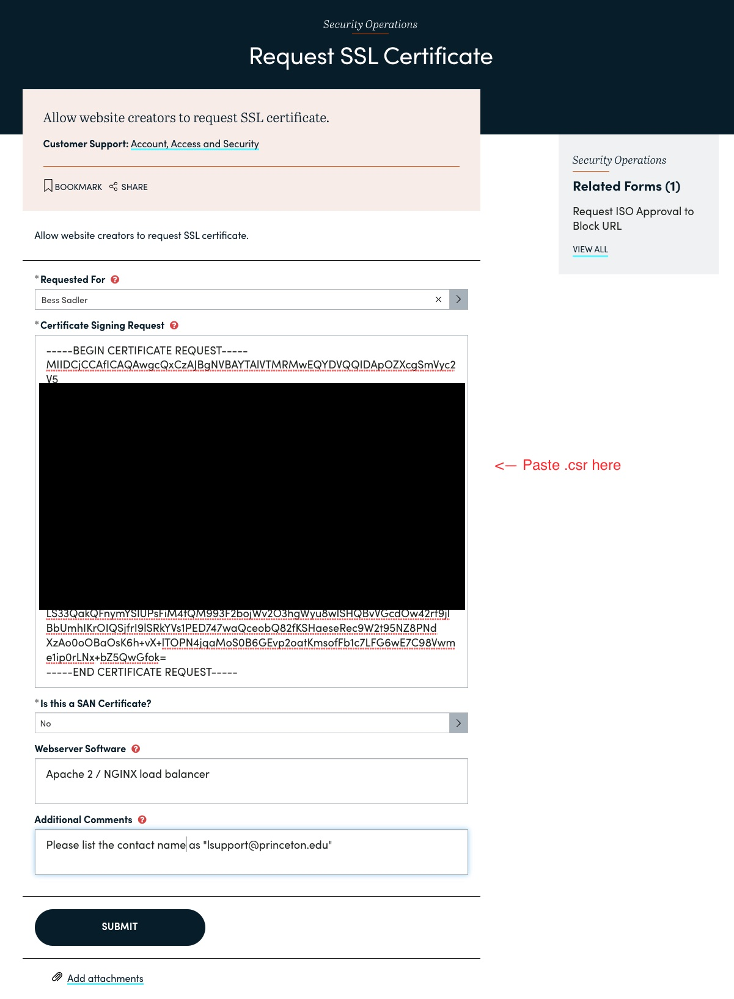
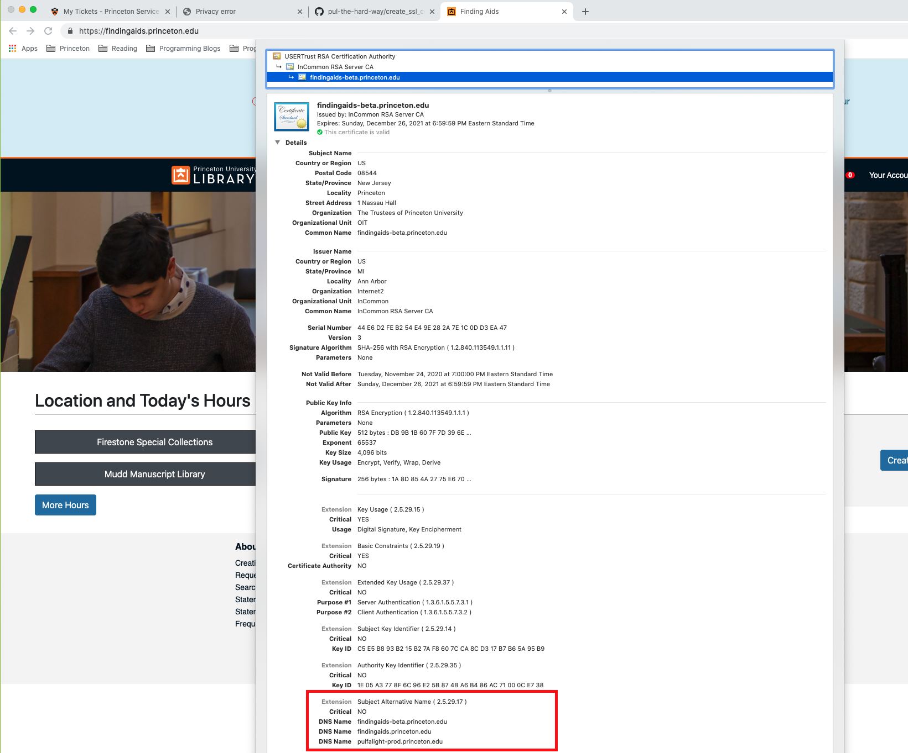

## Creating a TLS Certificate

### Overview of process

1. Create a CSR (certificate signing request)
2. Submit it to OIT via [this form](https://princeton.service-now.com/service?id=sc_cat_item&sys_id=c85dafbd4f752e0018ddd48e5210c7e4)
3. Your SSL cert will be created and returned to you via a Princeton Service Portal ticket within 24 hours
4. Verify the files you get back and add them to your server configuration.

### Detailed instructions

#### 1. Create the Certificate Signing Request

   1. For a site with no Subject Alternative Name (SAN)[1]

      * Export an environment variable with the host name for later commands
        ```
        export NEW_HOST_NAME=<new host name>
        ```
      * Create a file named `$NEW_HOST_NAME.cnf` with the following command

        ```ini
        echo "[req]
        default_bits = 2048
        distinguished_name = dn
        prompt             = no
        [dn]
        C=\"US\"
        ST=\"New Jersey\"
        L=\"Princeton\"
        O=\"The Trustees of Princeton University\"
        OU="OIT"
        emailAddress=\"lsupport@princeton.edu\"
        CN=\"$NEW_HOST_NAME.princeton.edu\"" > $NEW_HOST_NAME.cnf
        ```

      * Generate the certificate which you will provide to
        [OIT](https://princeton.service-now.com/snap?sys_id=c85dafbd4f752e0018ddd48e5210c7e4&id=sc_cat_item&table=sc_cat_item)
        with the following command

        ```bash
        openssl req -out ${NEW_HOST_NAME}_princeton_edu.csr -newkey rsa:2048 -nodes -keyout ${NEW_HOST_NAME}_princeton_edu_priv.key -config ${NEW_HOST_NAME}.cnf
        ```

      The step :point_up_2: above will create `${NEW_HOST_NAME}_princeton_edu.csr` and
      `${NEW_HOST_NAME}_princeton_edu_priv.key` in your current directory.


   1. For a site with a Subject Alternative Name (SAN)

      * Export an environment variable with the host name for later commands
        ```
        export NEW_HOST_NAME=<new host name>
        ```

      * Create a file named `${NEW_HOSTNAME}_san.cnf` with the following command:

        ```ini
        echo "[ req ]
        default_bits       = 4096
        distinguished_name = dn
        req_extensions     = req_ext
        prompt             = no
        [ dn ]
        C=\"US\"
        ST=\"New Jersey\"
        L=\"Princeton\"
        O=\"The Trustees of Princeton University\"
        OU=\"OIT\"
        emailAddress=\"lsupport@princeton.edu\"
        CN=\"$NEW_HOST_NAME.princeton.edu\"
        [ req_ext ]
        subjectAltName = @alt_names
        [alt_names]
        DNS.1   = \"${NEW_HOST_NAME}.princeton.edu\"
        DNS.2   = \"\"" > ${NEW_HOST_NAME}_san.cnf
        ```
      * Edit the file to add your additional Alternative name

      * Generate the certificate you will provide to
        [OIT](https://princeton.service-now.com/snap?sys_id=c85dafbd4f752e0018ddd48e5210c7e4&id=sc_cat_item&table=sc_cat_item)
        with the following command

        ```bash
        openssl req -out ${NEW_HOST_NAME}_princeton_edu.csr -newkey rsa:4096 -nodes -keyout ${NEW_HOST_NAME}_princeton_edu_priv.key -config ${NEW_HOST_NAME}_san.cnf
        ```

      The step :point_up_2: above will create `${NEW_HOST_NAME}_princeton_edu.csr` and
      `${NEW_HOST_NAME}_princeton_edu_priv.key` in your current directory.

#### 2. Submit the Certificate request to OIT

Submit the CSR via [this form](https://princeton.service-now.com/service?id=sc_cat_item&sys_id=c85dafbd4f752e0018ddd48e5210c7e4). Use the following guidance:

   * (SKIP if not SAN) Before submitting it you can check to see if your CSR contains the SAN you
     specified in the `${NEW_HOST_NAME}_san.cnf` file by doing.

      ```bash
      openssl req -noout -text -in ${NEW_HOST_NAME}_princeton_edu.csr | grep DNS
      ```

    * Provide a `cat`'ed copy of the Certificate Signing Request to
      [OIT](https://princeton.service-now.com/snap?sys_id=c85dafbd4f752e0018ddd48e5210c7e4&id=sc_cat_item&table=sc_cat_item)
      with the following command

      ```
      cat ${NEW_HOST_NAME}_princeton_edu.csr
      ```

   * Include a note requesting that the contact name be listed as "lsupport@princeton.edu" - this ensures that the certificate expiration notice generates a SN@P ticket instead of going to just an individual.
   
   

#### 3. Check your ticket the following day

   * OIT will create the certificates and respond via email within 24 hours

#### 4. Verify the files you get back 

   * Usually OIT provides the certificates in separate files, but sometimes they post them as comments in the ticket.  If this is the case copy the comments in the ticket into the files before proceeding to the next step:

      * `vi ${NEW_HOST_NAME}_princeton_edu_cert.cer` and copy and paste including `-----BEGIN CERTIFICATE-----` to `-----END CERTIFICATE-----`
      * `vi ${NEW_HOST_NAME}_princeton_edu_interm.cer` and copy and paste the rest of the certificates marked as `X.509 Root/Intermediate(s)`.  This should have Multiple begin and end certificates, which should be included.

1. Create the chained file from the data returned by OIT:

   * Concatenate the certificate and the intermediate certificates to create a chained `.pem` file that includes the contents of both files:

      ```bash
      cat ${NEW_HOST_NAME}_princeton_edu_cert.cer ${NEW_HOST_NAME}_princeton_edu_interm.cer > ${NEW_HOST_NAME}_princeton_edu_chained.pem
      ```

1. Verify the certificates

    * Make sure the certificates match (the private key must be unencrypted):

    ```bash
    echo "--Certificate:" && openssl x509 -noout -modulus -in ${NEW_HOST_NAME}_princeton_edu_chained.pem && echo "--Key:" && openssl rsa -noout -modulus -in ${NEW_HOST_NAME}_princeton_edu_priv.key
    ```

    * Make sure the CN name matches ${NEW_HOST_NAME}_princeton_edu:

    ```bash
    openssl x509 -in ${NEW_HOST_NAME}_princeton_edu_chained.pem -text
    ```

1. Save the unencrypted private key

    * Add the unencrypted private key to Shared-SSLCerts directory of LastPass Enterprise

1. Encrypt the private key, and add the encrypted private key and the chained file to princeton-ansible:

    * Encrypt the private key with `ansible-vault` and add it to `nginxplus/files/ssl/${NEW_HOST_NAME}_princeton_edu_priv.key`

      ```
      cp ${NEW_HOST_NAME}_princeton_edu_priv.key roles/nginxplus/files/ssl/
      cd roles/nginxplus/files/ssl/
      ansible-vault encrypt ${NEW_HOST_NAME}_princeton_edu_priv.key
      ```
    * add the chained file to `nginxplus/files/ssl/`

      ```
      mv ${NEW_HOST_NAME}_princeton_edu_chained.pem roles/nginxplus/files/ssl/
      ```

[1] Subject Alternative Names are used when multiple domains share the same certificate as shown 
